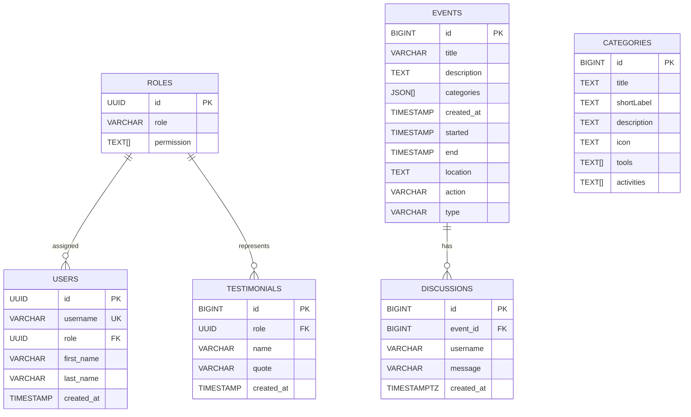

# Ground Zero Community Website

> Code Beyond Limits, Build Beyond Boundaries.

Welcome to the repository for the **Ground Zero Community** official website. This project is built using Next.js (App Router), Tailwind CSS v4, Framer Motion, and Lucide React, styled with a premium developer dark-mode aesthetic.

---

## 🚀 Quick Start

Ensure you have [Node.js](https://nodejs.org) (v18.x or higher) installed.

### 1. Install Dependencies
```bash
npm install
```

### 2. Configure Environment Variables

Create a local `.env` (or `.env.local`) file in the root directory and define the required parameters. You can copy the contents of `.env.sample` as a starting point:

```bash
cp .env.sample .env
```

#### Supabase Environment Variables

| Variable | Description |
| :--- | :--- |
| `NEXT_PUBLIC_SUPABASE_URL` | The API URL of your Supabase project (found in **Settings > API**). |
| `NEXT_PUBLIC_SUPABASE_PUBLISHABLE_KEY` | The `anon` (public) API key of your Supabase project (found in **Settings > API**). |
| `NEXT_PUBLIC_SUPABASE_PASSWORD` | The database password for your Supabase project. |
| `NEXT_PUBLIC_SUPABASE_SERVICE_ROLE_KEY` | The secret `service_role` API key of your Supabase project (found in **Settings > API**). Used in server-side routes to bypass Row Level Security. Do **not** expose this key on the client side. |

#### GitHub OAuth Variables

| Variable | Description |
| :--- | :--- |
| `NEXT_PUBLIC_GITHUB_ID` | Optional/reference GitHub OAuth Application Client ID. |
| `NEXT_PUBLIC_GITHUB_SECRET` | Optional/reference GitHub OAuth Application Client Secret. |

---

### 🔑 Setting up GitHub OAuth with Supabase

This project uses Supabase Authentication paired with a GitHub OAuth Provider for administrator login flow (`/admin`). Follow these steps to configure the integration:

#### 1. Register a GitHub OAuth Application
1. Go to your GitHub profile -> **Settings** -> **Developer Settings** -> **OAuth Apps**.
2. Click **New OAuth App**.
3. Set the following parameters:
   - **Application Name**: `Ground Zero Community (Dev)` or similar.
   - **Homepage URL**: `http://localhost:3000` (or your active hosting URL).
   - **Authorization callback URL**: `https://<your-supabase-project-ref>.supabase.co/auth/v1/callback`  
     *(Replace `<your-supabase-project-ref>` with the unique reference ID of your Supabase project.)*
4. Click **Register Application**.
5. Copy the generated **Client ID** and click **Generate a new client secret** to obtain your **Client Secret**.

#### 2. Configure GitHub Provider in Supabase
1. Open your [Supabase Dashboard](https://supabase.com/dashboard) and navigate to your project.
2. Go to **Authentication** (sidebar) -> **Providers** -> **GitHub**.
3. Toggle the switch to **Enable GitHub**.
4. Paste the **Client ID** and **Client Secret** copied from GitHub.
5. Save your changes.

---

### 🗄️ Database Schema Setup

The application interacts with and joins a set of tables in Supabase. Run the following queries in the Supabase **SQL Editor** to initialize the required tables:

**NOTE**: Please read the comments first, before you create the tables. And please look for the diagram for references.

#### 1. `roles` Table
```sql
create table public.roles (
  id uuid not null default gen_random_uuid(),
  role character varying not null,
  permission text[] null,
  constraint roles_pkey primary key (id)
) TABLESPACE pg_default;
```

#### 2. `users` Table
```sql
create table public.users (
  id uuid not null default auth.uid (),
  username character varying not null,
  first_name character varying null,
  last_name character varying null,
  created_at timestamp without time zone not null default now(),
  role uuid null default 'default_outsider_role_id'::uuid, -- You must have the Roles Table and set the default value of this for outsider role
  constraint users_pkey primary key (id),i
  constraint users_username_key unique (username),
  constraint users_role_fkey foreign KEY (role) references roles (id)
) TABLESPACE pg_default;
```

Where the `default` value of role was the outsider role or lowest role

#### 3. `testimonials` Table
```sql
create table public.testimonials (
  id bigint generated by default as identity not null,
  name character varying not null,
  role uuid null default 'default_outsider_role_id'::uuid, -- You must have the Roles Table and set the default value of this for outsider role
  quote character varying not null,
  created_at timestamp without time zone not null default now(),
  constraint testimonials_pkey primary key (id),
  constraint testimonials_role_fkey foreign KEY (role) references roles (id) on update CASCADE on delete set null
) TABLESPACE pg_default;
```

#### 4. `events` Table
```sql
create table public.events (
  id bigint generated by default as identity not null,
  title character varying not null,
  description text null,
  categories json[] null,
  created_at timestamp without time zone not null default now(),
  started timestamp without time zone not null default now(),
  "end" timestamp without time zone not null default now(),
  location text null,
  action character varying not null default 'Register Now'::character varying,
  type character varying not null default 'Virtual'::character varying,
  constraint events_pkey primary key (id)
) TABLESPACE pg_default;
```

#### 5. `categories` Table
```sql
create table public.categories (
  id bigint generated by default as identity not null,
  title text not null,
  "shortLabel" text not null,
  description text null,
  icon text null,
  tools text[] null,
  activities text[] null,
  constraint categories_pkey primary key (id)
) TABLESPACE pg_default;
```

#### 6. `discussions` Table
```sql
create table public.discussions (
  id bigint generated by default as identity not null,
  event_id bigint null,
  username character varying not null,
  created_at timestamp with time zone not null default now(),
  message character varying not null,
  constraint discussions_pkey primary key (id),
  constraint discussions_event_id_fkey foreign KEY (event_id) references events (id) on update CASCADE on delete set null
) TABLESPACE pg_default;
```

#### Database Schema



---

### 3. Run the Development Server
```bash
npm run dev
```
Open [http://localhost:3000](http://localhost:3000) in your browser to view the active dev server.

### 4. Check for Lint Warnings & Build
Before submitting code, check for linter violations and build compiling status:
```bash
npm run lint
npm run build
```

---

## 🛠️ Technology Stack

- **Core Framework**: [Next.js 16 (App Router)](https://nextjs.org/)
- **Logic & UI Libraries**: [React 19](https://react.dev/), [Framer Motion 12](https://www.framer.com/motion/)
- **Style Compilation**: [Tailwind CSS v4](https://tailwindcss.com/)
- **Icons**: [Lucide React](https://lucide.dev/)
- **Typography Stack**:
  - **Space Grotesk** (Base body and headers)
  - **Space Mono** (Technical, monospaced prompts, code variables, stats counters)

---

## 📂 Directory Layout

```text
├── public/                  # Static assets (favicons, official logos)
│   ├── images/
│   │   └── logo.png         # Official GZ emblem
├── src/
│   ├── app/                 # Next.js App Router (pages & global layouts)
│   │   ├── admin/           # Admin endpoint for admin controls
│   │   ├── api/             # API Endpoints for asyncronous access
│   │   ├── globals.css      # Core styles & Tailwind v4 theme configurations
│   │   ├── layout.tsx       # Root layout containing font load variables
│   │   └── page.tsx         # Root landing page assembly
│   ├── components/
│   │   ├── sections/        # Section-specific components (Hero, FAQ, etc.)
│   │   ├── shared/          # Persistent components (Navbar, Footer)
│   │   └── ui/              # Reusable UI primitives (Button, Card, Badge)
│   ├── hooks/               # Custom React hooks (useScroll)
│   └── lib/                 # Shared utilities (cn helper)
```

---

## 🤝 Collaboration & Contribution

We welcome contributions from developers, UI/UX designers, creators, and students of all experience levels! 

Please read our [**CONTRIBUTING.md**](file:///c:/Users/0x3EF8/Desktop/GZ/ground-zero/CONTRIBUTING.md) developer handbook for details on coding standards, branching structures, design system tokens, and pull request procedures.

---

## 💬 Connect with the Community

- **Discord Server**: [Join Discord](https://discord.gg/4H2v6UwjmY)
- **Facebook Page**: [Follow Page](https://www.facebook.com/GroundZeroDigital/)
- **Facebook Group**: [Join Group](https://www.facebook.com/groups/groundzerocommunity/)
- **GitHub Organization**: [View Codebases](https://github.com/GroundZeroCommunity)
